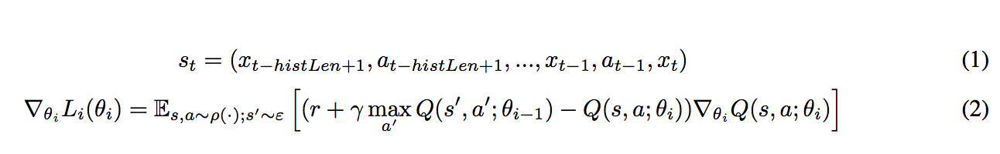
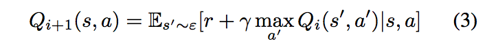
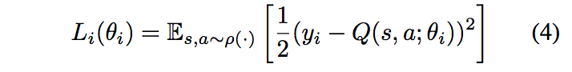
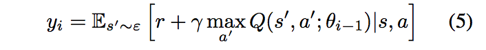
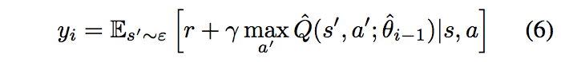
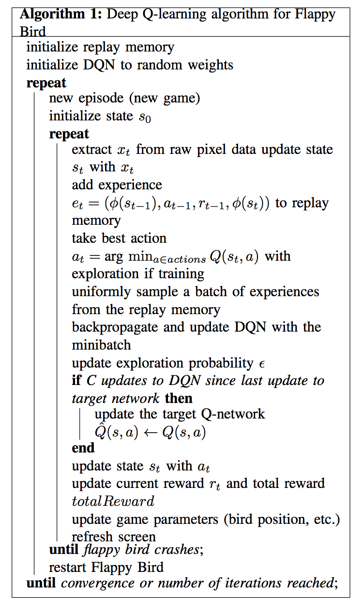
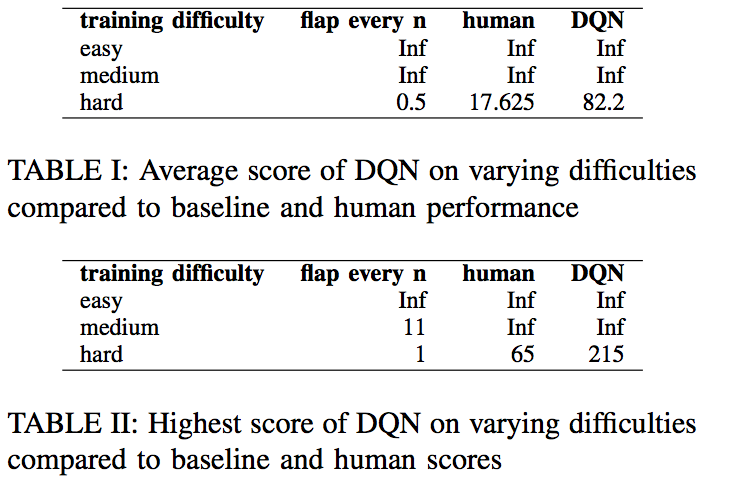
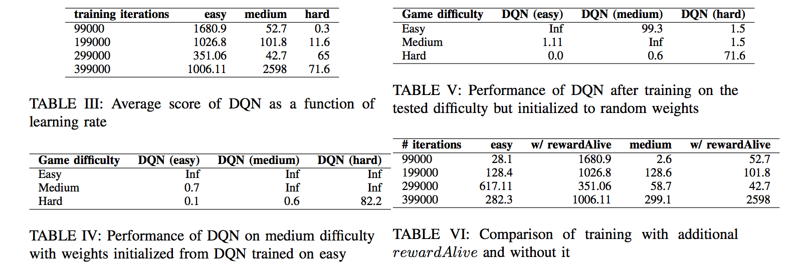

# 介绍
如何编写程序让一个机器人完成“从A出发到达指定目的地B取餐，取餐之后再送到目的地C”这项任务？可以将每次移动硬编码作为机器人的操作指令，但很显然无法应对复杂多变的场景。取而代之的，应该通过强化学习训练agent并根据获取到的状态信息自行决策。这篇文章将以训练agent玩转Flappy Bird的方式讲述RL的应用。

作为一个曾经风靡一时的游戏，不再赘述FlappyBird的游戏规则。需要重点说明的是，1）agent可以采取向上、不作为两个动作，2）越过的管道数作为得分。所以，要获得高分数，就要让Bird存活的时间尽量长久。

因为可用的数据只有游戏画面像素数据和得分数据，用传统的机器学习方法训练agent特别困难。agent获取不到Bird长什么样子，管道长什么样子，以及Bird、管道的位置。所以，必须与游戏引擎进行不断交互，从中学习如何用特征表达状态以及做出何种决策。

# 方法
## MDP

强化学习五个要素：

* 动作（action）：a=1表示向上，a=0表示不作为。
* 状态（state）：由连续<帧（游戏画面）、agent做成的动作>组成的序列表示，如公式1所示。一个状态有histLen帧图像及histLen个动作组成。这里之所以使用序列信息，是因为单帧图片只能反映位置信息，无法反应速度等信息。
* 转移概率（transition probabilities）：未知
* 奖励（rewards）：未知
* 衰减因子（γ）：0.95

因为后续使用Q-learning，而Q-learning是一个model-free的方法，所以，不需要对转移概率和奖励进行精确估计，而是在后续直接估计Q函数。详细内容在下一小节介绍。

尽管如此，还是应该对奖励进行明确地定义。理想状况下，奖励应该和游戏得分保持一致，游戏开始时奖励为0，bird每经过一个管道则奖励加1.这种方式存在奖励稀疏的潜在问题。例如，在游戏开始阶段失败和在管道附近失败的奖励是一样的。但是从直觉上来说，在管道附近失败要比开始阶段失败表现得更好。所以，有必要追加一个额外的奖励：幸存时长，让agent和直觉保持一致。当然，不设置额外的奖励也可以训练，但是实验证明引入额外的奖励可以加速训练过程。这里共设计了三种奖励：

* rewardAlive：Bird下一帧中存活，则获得奖励
* rewardPipe：Bird越过管道时，追加奖励
* rewardDead： Bird时获得的奖励

## Q-learning
强化学习的目标是最大化最终收益。在Q-learning中我们采用Bellman方程更新Q值：

* s'表示下一个状态
* r表示奖励
* ε表示环境
* Qi+1(s, a)表示第i+1次迭代的Q函数

这种求解方式（rote learning）比较死板，无法扩展到未观察到的状态，为了解决这个问题就有了函数近似的方法。接下来的方法是使用了深度神经网络对函数进行近似，因为是图像问题，实际上采用的是CNN。

对于Q函数近似的loss函数为：

其中，θi表示Q网络第i次迭代的参数，yi表示第i次迭代的target。yi的定义如下：

可以理解为，loss指的是利用DQN训练集的结果与利用Bellman方程计算的结果之间的偏差。对于一次实验（experience）而言，e=(s, a, r, s′ )，可以看做是机器学习中的一个样本；一组实验，可以看做机器学习中一个数据集。基于损失函数的梯度计算公式（公式2），我们就可以采用随机梯度下降方法和反向传播对神经网络参数进行更新。

此外，采用ε-贪婪方法来解决Q-learning中的E&E问题。具体而言，在训练过程中，有ε的概率随机采用动作，而不是绝对采用最佳动作。在训练过程中从开始到结束的过程中，本文采用了1~0.1线性改变ε的取值，这样可以鼓励在开始阶段更多地进行探索。

## 经验回放
为了便于讲述，首先做一下定义。episode：表示一次游戏从开始到结束，其中包含多个experience。传统的Q-learning存在一个问题，同一个episode的连续多帧图像会有大量的信息重复，experience之间具有极高的相关性，这会引起训练效率低下的问题。为了降低experience之间的相关性，我们采用了经验回放（experience replay）。每次训练时，一个batch的experience从经验回放池中均匀采样。这样，一个batch中的experience之间不再具有强相关性。

## 稳定性
为了在计算损失函数时更加稳定，引入Q-hat。Q-hat与Q结构相同，参数不同。每次训练时，同时跟新Q和Q-hat的参数。计算Q的yi时不再使用Q，而是使用Q-hat。这样可以保证更新DQN参数时更加稳定。

## 预处理
如前所述，数据中包含多帧图像，信息量比较大，需要做一下预处理。原始图像为512 × 288 pixels，3通道。和其他图像处理类似，将三通道图转为灰度图。并做下采样，转为102×86 pixel。然后做reshape变为80 × 80，将像素从[0, 255]归一化至[0, 1]之间。我们将这一系列特征提取的操作记做φ(s)。

## Deep Q-Network
OK，如前所述，Q函数由一个DNN近似，输入为80 × 80 × historyLength 的图像序列，输出每一个动作的概率。网络结构如下所是：

最终选择概率最高的动作。

## 流程
总结起来，整个流程如下所示：

# 结果

## 测试参数
FlappyBird游戏以30帧/秒的速度运行，historyLength设置为5.衰减系数为0.95，奖励为: rewardAlive = +0.1, rewardPipe = +1.0, rewardDead = −1.0。对DQN做600000次更新，在此过程中探索概率ε从1下降至0.1。 replay memory的大小为20000 experiences。训练时优化方法采用RMSProp，学习率1e-6，decay为0.9，momentum为0.95.为了估计出比较好的参数，做了一些试错性质的工作。比方说，当学习率过大时会引起神经网络参数爆炸，最终用二分搜索算法寻找到了最优学习率。如果学习率太小，训练时间会特别的长。batch size设置为32(experiences)，只有replay memory至少达到3000 experiences时才会开始训练，而且没更新1000次DQN才会更新一次Q-hat。卷积网络的权重由正态分布（均值为0，方差0.1）初始化.深度神经网络采用tensorflow实现。

## 总体性能

实验分为3部分：

* DQN
* 人操作
* flap every n：根据最近几帧图像，让bird保持在图像中心。

table 1展示了平均得分，table展示了最高得分。DQN完胜人类操作水平。

## 训练时间

从table3可以看出，训练轮次增加，得分逐渐提升，但也可能出现波动。例如，easy、medium模式在299000轮训练时出现波动，在Hard模式中就没有出现波动。缓解这类问题的办法有：

* 随着训练轮次的增加，逐渐降低学习率；
* 提高模型复杂度（网络结构）

## 预训练网络
训练medium模式的DQN网络时，采用训练好的easy模式的DQN网络参数进行初始化，具有非常好的效果。而且，训练好的medium的agent，在预测/测试easy模式、hard模式时，也可以产生非常好的效果。从table4和table5中得出这样的结论。

## rewardAlive的重要性
通过实验验证rewardAlive是否能够真正的加速训练过程，如table6所示。增加rewardAlive避免了稀疏奖励，可以加速训练过程。

# 总结
agent通过获取图像和奖励，直接训练agent，能够达到超越人类的游戏水平。但是需要注意的是，并不是训练轮次越大效果越好，模型可能会存在过拟合，训练效果存在波动。第二个有意思的地方是，试验中引入了experience replay，在训练阶段从 experience replay随机筛选样本。第三，为了避免无关信息过多的干扰，实验将背景信息和得分提示信息剔除。