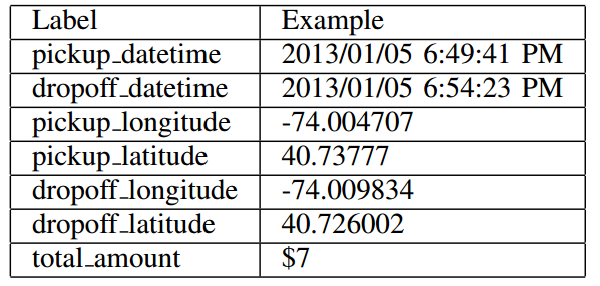
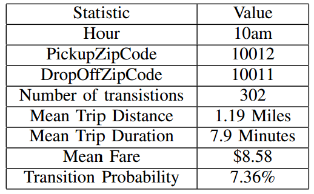
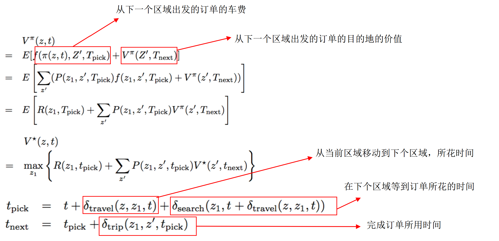
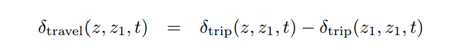
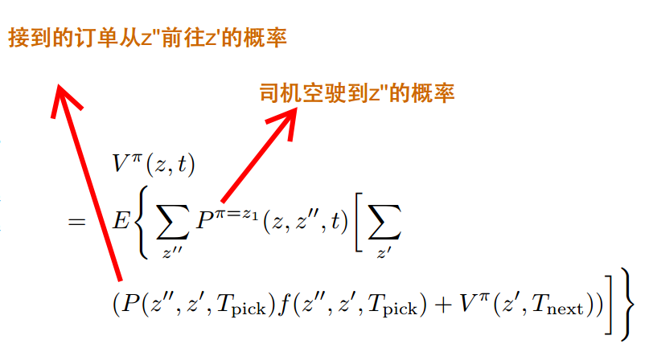

【利用增强学习提升Taxi收入】

看了两篇用增强学习技术提升Taxi司机收入的文章，做一下简单的梳理。这两篇文章的目的都是提升单个司机的收入，即，这个属于零和游戏的范畴：订单总量不变的情况下，提高单个司机的收入（to maximize the total revenue generated by an individual driver），必然会降低其他司机的收入。从这个角度讲，这篇文章并没有直接的工业应用价值，从paper过程中看到一些比较不错的思路，对以后的工作还是比较有帮助的。

# 1.Improving Taxi Revenue with Reinforcement Learning
这篇文章由斯坦福大学两位研究者于2014年发表。数据集是2013年纽约市出租车交易记录

基本信息包括了时间信息（上车时间，下车时间），位置信息（上车经纬度，下车经纬度），车费

## 数据预处理

为了便于建模，在时间和空间两个维度都做了离散化：

* 空间信息使用Geodis分桶，可以认为是geohash之类的地理编码，文中称为zipcode
* 时间信息分桶则是直接采用小时分桶hour

做了这些分桶之后，作者按照(hour, pickupzipcode, dropoffzipcode)维度统计了一些静态特征。

## 建模

### 1.需求量建模 Y=f(zipcode,hour,day of week,...)
估计单个小时单量比较稀疏，在文中提到“ we aggregated the number of trips every three hours for each zipcode”的做法，而且，除了区域编码、小时信息、工作日/周末信息之外，还是用了天气信息作为预估因素。

虽然作者做了需求量建模的事情，但是在后期并没有使用。

### 2.增强学习
#### 1)问题定义与学习框架
在司机完成一单之后，通常会有两种动作选择：

* 在当前区域寻找下一单
* 开往其他区域寻找订单

据我了解，现实当中会有司机从机场接单并送达之后，返回机场继续排队接单。 显然，司机开往其他区域寻找订单会带来一定的损耗。但是，如果选择得当，得到的额外收益会大于损失。这个时候很自然想到使用增强学习对优化过程进行量化，指导司机做出动作判断。为了对问题进行建模，对现实问题进行了一定的抽象。

* 状态(z, t)：完成订单的zipcode及时间
* 奖励R(z1, t1)：z1区域在t1时段订单的平均车费（假设司机不能拒载乘客）
* 价值函数V (z, t)：从状态(z, t)开始，直到一天结束，总收入的期望值
* 策略（Policy）π(z, t) = z1 ：司机可以半路“捡”乘客，但无法从历史数据中获悉，所以，为了降低复杂度，在这篇文章中假设，司机在(z, t)下会前往下一个区域z1搜索直到接到乘客（只会在z1区域内搜索并接单，不会半路接单，也不会再去其他区域搜索）。这里做了简化，只给出一个动作，而不是多个动作及其概率（这个在后续也有提到）。
* 对应价值函数：

其中：

* z1、Z'、Tpick、Tnext分别表示z1在Tpick时间获取到一个前往的z’的乘客，并在Tnext送达
* f(z1, z', Tpick)：表示在Tpick时段获取乘客后从z1前往z’所能获得的车费
* P(z1, z', t) ：在t时段在z1上车的乘客去z’的概率.

当然，以上方程成立的前提假设：所有变量之间是独立的。

需要注意的是，这篇文章中并不是中规中矩的增强学习方法，增强学习由5部分组成：

1. S 表示状态集 (states)；
2. A 表示动作集 (Action)；
3. P^s′_s,a 表示状态 s 下采取动作 a 之后转移到 s' 状态的概率；
4. R_s,a 表示状态 s 下采取动作 a 获得的奖励；
5. γ 是衰减因子。

如上所述，状态集S为（z,t）组成的状态空间，动作集A则表示前往的区域z‘组成的动作空间。这两部分都是已知的。状态转移概率可以通过历史数据计算获得，奖励定义为移动到z’之后获取到乘客带来的车费收入，也可以认为是间接已知的。

**这里有一点比较特殊：从一个状态转为另一个状态，中间有两部分组成**：

* 乘客dropoff，得到状态S1（s1,t1_dropoff）,采取动作a1，即前往z1区域。当然这里可以认为有一个区域转移概率，也可以认为是采取某个动作的概率。按照前文所述，这里只会输出一个动作。
* 司机在搜索区域获取一个订单，前往目的区域，dropoff之后达到状态S2（s2,t2_dropoff）。这里又有一个区域转移概率，即，乘客想去的目的地的概率。

而**如果想获取到状态转移概率，必须从空间和时间两个维度将S1到S2状态的各个环节分解清楚**。

#### 2）利用历史数据估计模型参数

* R(z1, t1)、P(z1, z', t)、delta_trip(z1, z0, t)可以通过历史数据分别计算。
* R(z1, t1)：历史平均车费
* P(z1, z', t)：z1到z’的历史转移概率
* delta_trip(z1, z', t):t时间段内，从z1载客到z1消耗的时间
* delta_travel:t时间段内，从z空驶到z1消耗的时间= “t时间段内，从z载客到z1消耗的时间” 减去 “t时间段内，从z1载客到z1消耗的时间”
* 

* delta_search:如果用平均等待时长估算，会相对偏小。作者认为等待时长更符合指数分布，并采取了一些trick。

#### 3）利用未来的数据更新模型参数

上面的Policy: π(z, t) = z1 ，表示策略是固定的，也可以使用概率的形式。

## 总结：

利用以上信息，就可以构建model-based的增强学习模型，而模型中每天的每个司机都是一个agent，司机每天的行为都是一个epoch。模型训练完成之后，可以知道单个司机在当前环境内找到最优的行为策略。

这个方法只能限于单个司机使用，如果所有司机都采用该系统，系统也就失效了。为了让整个系统达到最优，需要协调系统内所有司机的行为，公司雇佣更少的司机，司机最小化空置时间和工作时间，用户在高峰期可以看到更多的出租车。当然，在公司角度如何构建增强学习系统，则又是另外一个问题。

